# 🎓 GesPresence — Application de Gestion de Présence des Étudiants

<div align="center">


**Application web complète de gestion de présence des étudiants — inspirée du portail OFPPT**

[🚀 Démo](#-démarrage-rapide) • [📐 Architecture](#-architecture) • [🗄️ Base de données](#️-modèle-de-données) • [📋 Fonctionnalités](#-fonctionnalités)

</div>

---

## 📋 Table des Matières

1. [Vue d'ensemble](#-vue-densemble)
2. [Stack Technique](#-stack-technique)
3. [Architecture](#-architecture)
4. [Modèle de Données — MCD](#️-modèle-de-données--mcd)
5. [Modèle Logique — MLD](#-modèle-logique--mld)
6. [Diagramme de Classes UML](#-diagramme-de-classes-uml)
7. [Cas d'Utilisation](#-diagrammes-de-cas-dutilisation)
8. [Diagrammes de Séquence](#-diagrammes-de-séquence)
9. [Diagramme d'État](#-diagramme-détat--présence)
10. [Diagramme de Composants](#-diagramme-de-composants)
11. [Fonctionnalités](#-fonctionnalités)
12. [Structure du Projet](#-structure-du-projet)
13. [Démarrage Rapide](#-démarrage-rapide)
14. [Comptes de Test](#-comptes-de-test)
15. [API des URLs](#-api-des-urls)
16. [Données de Test](#-données-de-test)

---

## 🌟 Vue d'ensemble

**GesPresence** est une application web Django permettant de gérer la présence des étudiants dans un établissement de formation (OFPPT). Elle offre une interface dédiée pour chaque type d'utilisateur, des notifications automatiques aux parents en cas d'absence, et la génération de rapports détaillés.

### Captures d'écran

| Dashboard Admin | Feuille de Présence | Dashboard Enseignant |
|:---:|:---:|:---:|
| Statistiques temps réel | Marquage rapide | Sessions du jour |

---

## 🛠 Stack Technique

| Couche | Technologie | Version |
|--------|-------------|---------|
| **Backend** | Django | 4.2 LTS |
| **Langage** | Python | 3.13 |
| **Base de données** | MySQL (XAMPP/MariaDB) | 10.4+ |
| **Frontend** | Bootstrap + Jinja2 | 5.3 |
| **Icônes** | Bootstrap Icons | 1.11 |
| **Export** | openpyxl, reportlab | latest |
| **Auth** | Django Auth (AbstractUser) | — |
| **Env** | python-decouple | 3.8 |
| **Static** | WhiteNoise | 6.x |

---

## 🏗 Architecture

### Pattern MVT (Model–View–Template)

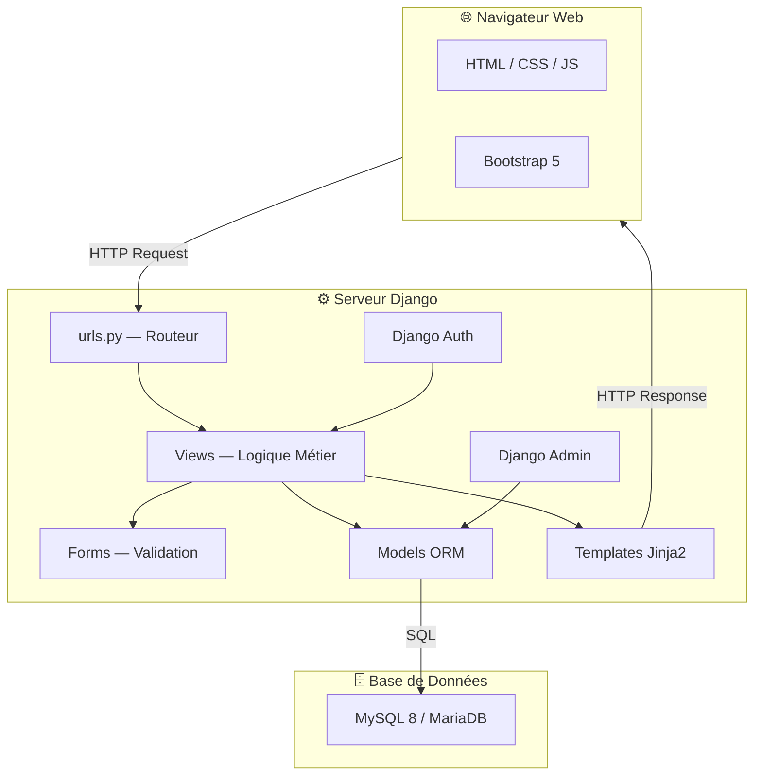

### Flux d'une Requête

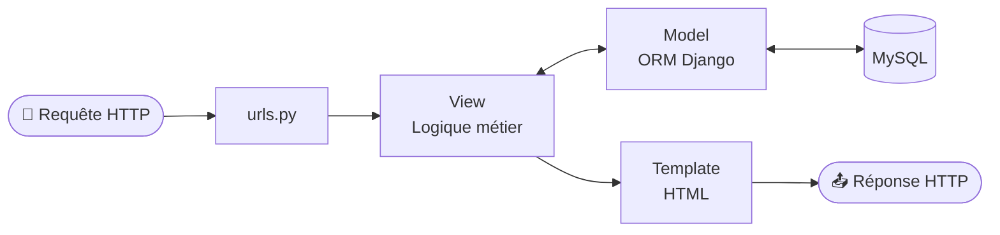

---

## 🗂️ Modèle de Données — MCD

> Le MCD représente les entités métier et leurs associations sans implémentation physique.

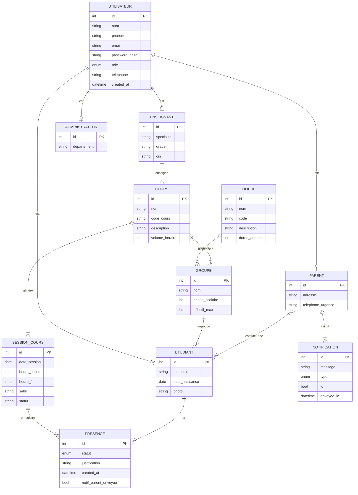

---

## 📊 Modèle Logique — MLD

> Le MLD traduit le MCD en tables relationnelles avec clés primaires et étrangères.

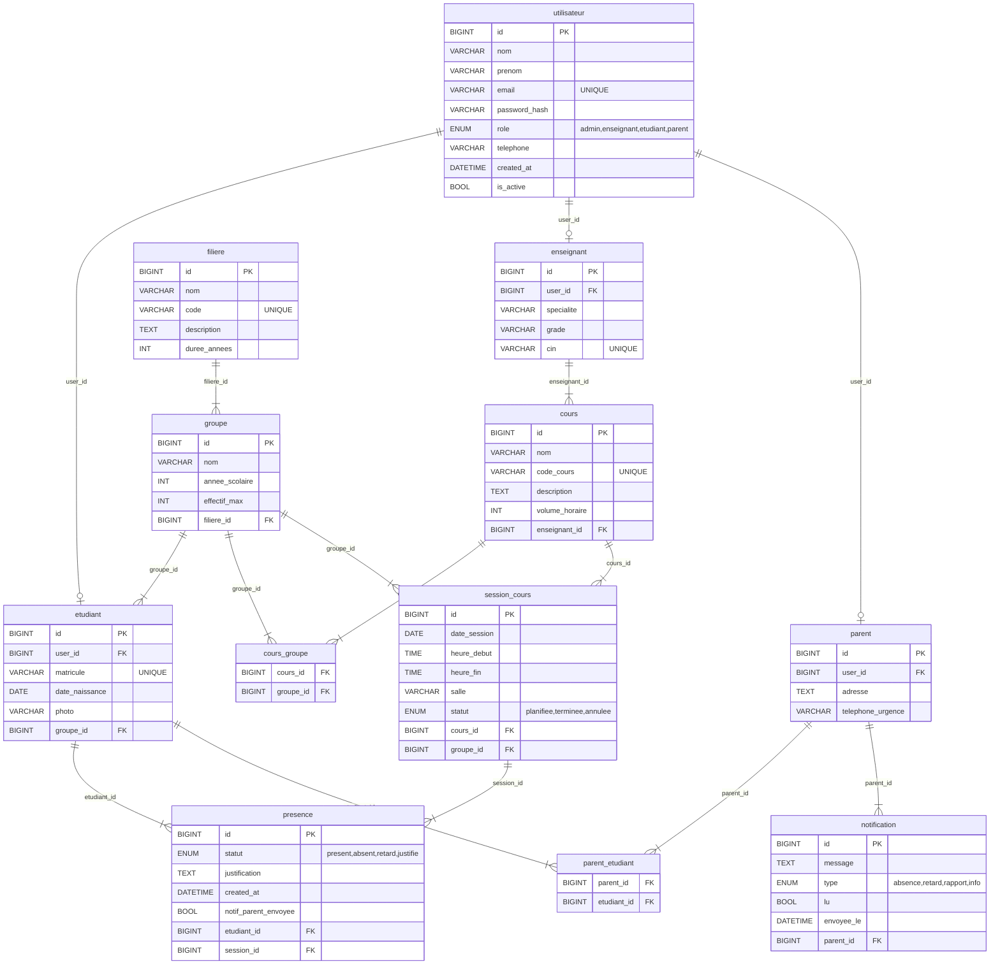

---

## 🧩 Diagramme de Classes UML

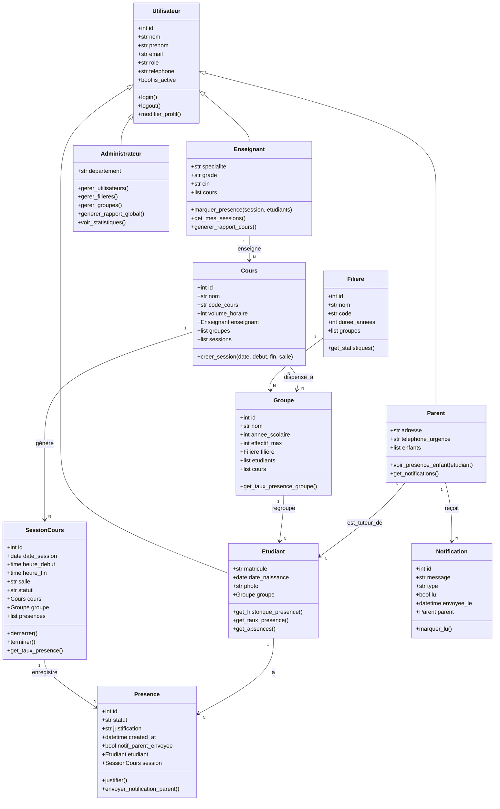

---

## 👥 Diagrammes de Cas d'Utilisation

### Vue Globale

```mermaid
flowchart TB
    ADMIN(["👤 Administrateur"])
    ENSEIGNANT(["👤 Enseignant"])
    ETUDIANT(["👤 Étudiant"])
    PARENT(["👤 Parent"])

    subgraph SYS["🎓 Système GesPresence"]
        AUTH["Se connecter / Déconnecter"]
        PROFIL["Modifier son profil"]

        subgraph ADM_MOD["Module Administration"]
            GU["Gérer Utilisateurs"]
            GF["Gérer Filières & Groupes"]
            GC["Gérer Cours"]
            STAT["Voir Statistiques Globales"]
            RAPP["Générer Rapports"]
        end

        subgraph ENS_MOD["Module Enseignant"]
            VS["Voir Mes Sessions"]
            MP["Marquer Présence"]
            JA["Justifier une Absence"]
            RC["Rapport Cours"]
        end

        subgraph ETU_MOD["Module Étudiant"]
            HP["Consulter Mon Historique"]
            TP["Voir Mon Taux de Présence"]
        end

        subgraph PAR_MOD["Module Parent"]
            VP["Voir Présence Enfant"]
            NOTIF["Consulter Notifications"]
        end
    end

    ADMIN --> AUTH & PROFIL & GU & GF & GC & STAT & RAPP
    ENSEIGNANT --> AUTH & PROFIL & VS & MP & JA & RC
    ETUDIANT --> AUTH & PROFIL & HP & TP
    PARENT --> AUTH & PROFIL & VP & NOTIF
```

---

## 🔄 Diagrammes de Séquence

### 1. Authentification

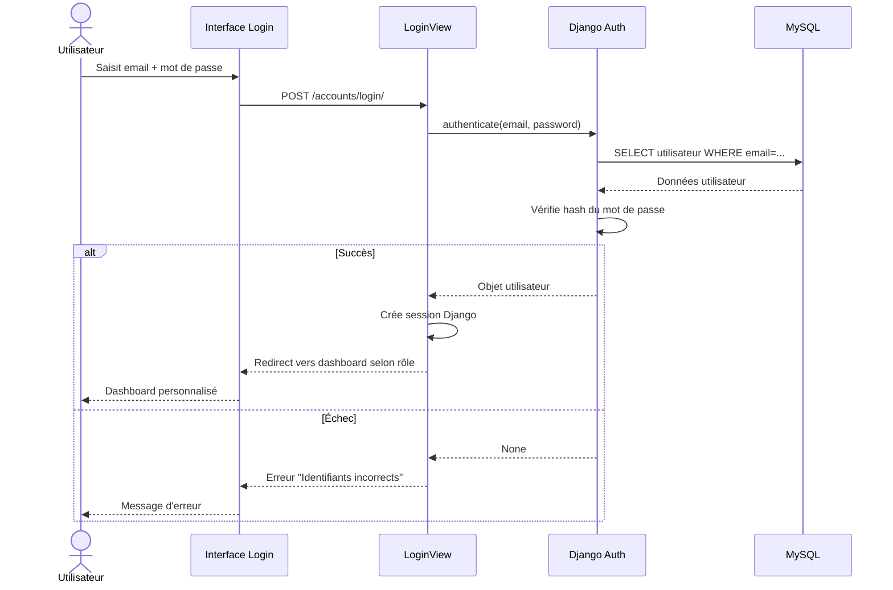

### 2. Marquer la Présence (Enseignant)

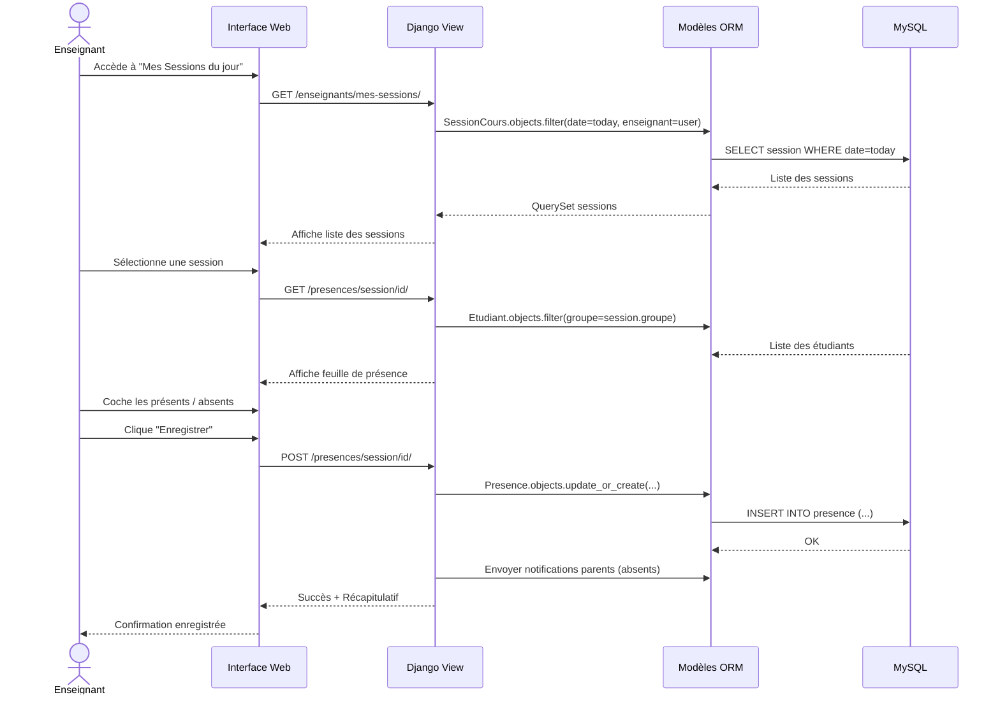

### 3. Consultation Parent

```mermaid
sequenceDiagram
    actor PAR as Parent
    participant UI as Interface Parent
    participant VIEW as ParentView
    participant MODEL as ORM

    PAR->>UI: Accède au tableau de bord
    UI->>VIEW: GET /accounts/dashboard/
    VIEW->>MODEL: Parent.objects.get(user=request.user)
    MODEL-->>VIEW: Objet parent + enfants liés
    VIEW->>MODEL: Presence.objects.filter(etudiant__in=enfants).recent()
    MODEL-->>VIEW: Historique des présences
    VIEW-->>UI: Dashboard avec historique + alertes
    UI-->>PAR: Affiche données

    PAR->>UI: Clique sur une notification
    UI->>VIEW: POST /notifications/id/lire/
    VIEW->>MODEL: notification.lu = True; save()
    VIEW-->>UI: Notification marquée comme lue
```

### 4. Génération de Rapport

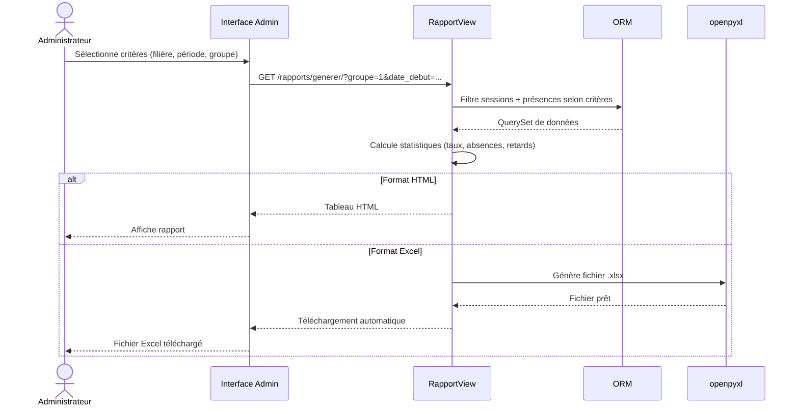

---

## 🔁 Diagramme d'État — Présence

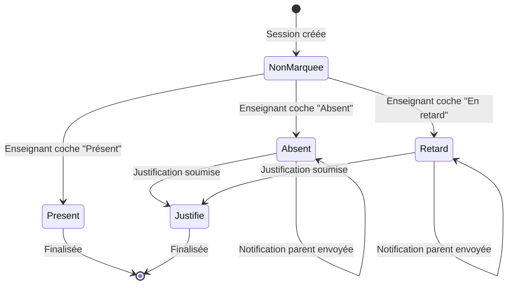

---

## 🧱 Diagramme de Composants

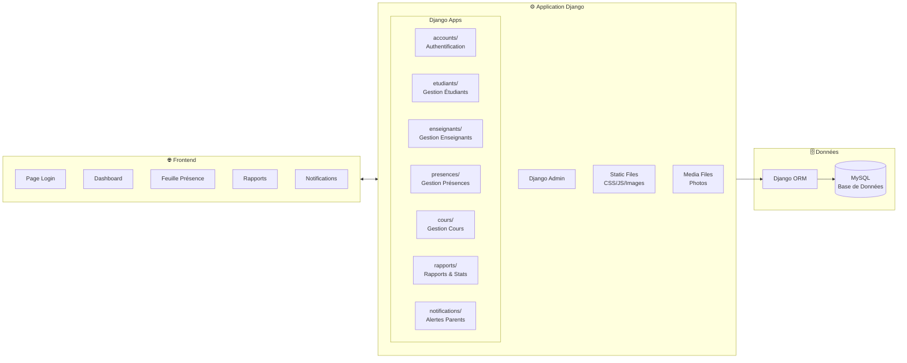

---

## ✨ Fonctionnalités

### Par Rôle

| Fonctionnalité | Admin | Enseignant | Étudiant | Parent |
|---|:---:|:---:|:---:|:---:|
| Dashboard personnalisé | ✅ | ✅ | ✅ | ✅ |
| Gestion utilisateurs | ✅ | ❌ | ❌ | ❌ |
| Gestion filières/groupes | ✅ | ❌ | ❌ | ❌ |
| Gestion cours | ✅ | ❌ | ❌ | ❌ |
| Marquer présence | ❌ | ✅ | ❌ | ❌ |
| Consulter historique | ✅ | ✅ | ✅ | ✅ |
| Notifications parents | auto | auto | ❌ | ✅ |
| Rapports & statistiques | ✅ | ❌ | ❌ | ❌ |
| Export Excel | ✅ | ❌ | ❌ | ❌ |
| Django Admin | ✅ | ❌ | ❌ | ❌ |

### Statuts de Présence

```
● Présent   — Cours suivi normalement
● Absent    — Non présent + notification parent
● Retard    — Arrivée tardive + notification parent
● Justifié  — Absence avec justificatif accepté
```

---

## 📁 Structure du Projet

```
gespresence/
├── manage.py
├── requirements.txt
├── .env                          # Variables d'environnement
├── seed_data.py                  # Script données initiales
├── seed_parents.py               # Script parents
│
├── gespresence/                  # Configuration Django
│   ├── settings.py
│   ├── urls.py
│   ├── wsgi.py
│   └── asgi.py
│
├── accounts/                     # Auth & Utilisateurs
│   ├── models.py                 # Utilisateur, Etudiant, Enseignant, Parent...
│   ├── views.py                  # login, logout, dashboard, profil
│   ├── forms.py                  # LoginForm
│   ├── urls.py
│   ├── admin.py
│   └── decorators.py             # role_required
│
├── etudiants/                    # Gestion Étudiants
├── enseignants/                  # Gestion Enseignants
│
├── cours/                        # Cours, Sessions, Emploi du temps
│   ├── models.py                 # Cours, SessionCours
│   ├── admin.py
│   ├── views.py
│   └── urls.py
│
├── presences/                    # Marquage & Historique
│   ├── models.py                 # Presence
│   ├── views.py                  # feuille_presence, historique
│   ├── urls.py
│   └── templatetags/
│       └── presence_filters.py   # get_item, get_statut
│
├── rapports/                     # Statistiques & Exports
│   └── views.py                  # export Excel via openpyxl
│
├── notifications/                # Alertes Parents
│   └── models.py                 # Notification
│
├── static/
│   ├── css/
│   │   └── main.css              # Thème OFPPT
│   └── js/
│
├── media/                        # Fichiers uploadés
│
└── templates/
    ├── base.html                 # Layout principal + sidebar
    ├── dashboard_admin.html
    ├── dashboard_enseignant.html
    ├── dashboard_etudiant.html
    ├── dashboard_parent.html
    ├── accounts/
    ├── etudiants/
    ├── enseignants/
    ├── cours/
    ├── presences/
    ├── rapports/
    └── notifications/
```

---

## 🚀 Démarrage Rapide

### Prérequis

- Python 3.10+
- MySQL 8 / MariaDB 10.4+ (XAMPP recommandé)
- Git

### Installation

```bash
# 1. Cloner le dépôt
git clone https://github.com/abdeladimdemnati3-hash/project_de_presance-d-etudiant.git
cd "project_de_presance-d-etudiant"

# 2. Créer l'environnement virtuel
python -m venv venv
.\venv\Scripts\activate          # Windows
# source venv/bin/activate       # Linux/Mac

# 3. Installer les dépendances
pip install -r requirements.txt

# 4. Configurer les variables d'environnement
cp .env.example .env
# Éditer .env : DB_NAME, DB_USER, DB_PASSWORD
```

### Configuration `.env`

```ini
SECRET_KEY=votre-clé-secrète-longue-et-aléatoire
DJANGO_DEBUG=True
ALLOWED_HOSTS=127.0.0.1,localhost

DB_NAME=gespresence_db
DB_USER=root
DB_PASSWORD=
DB_HOST=localhost
DB_PORT=3306
```

### Base de données & Migrations

```bash
# Créer la base de données MySQL
mysql -u root -e "CREATE DATABASE gespresence_db CHARACTER SET utf8mb4;"

# Appliquer les migrations
python manage.py makemigrations
python manage.py migrate

# Créer le superutilisateur
python manage.py createsuperuser
```

### Données de Démonstration

```bash
# Créer filières, groupes, professeurs, cours, 96 sessions
python seed_data.py

# Créer 35 étudiants + 35 parents (un par étudiant)
python seed_parents.py
```

### Lancer le Serveur

```bash
python manage.py runserver 8000
```

🌐 Ouvrir [http://127.0.0.1:8000/](http://127.0.0.1:8000/)

---

## 🔑 Comptes de Test

| Rôle | Username | Mot de passe | Description |
|------|----------|-------------|-------------|
| **Administrateur** | `admin` | `admin1234` | Accès complet |
| **Enseignant** | `prof_karim` | `prof1234` | Développement Web |
| **Enseignant** | `prof_sara` | `prof1234` | Python & Django |
| **Enseignant** | `prof_youssef` | `prof1234` | Réseaux & Cybersécurité |
| **Enseignant** | `prof_fatima` | `prof1234` | Comptabilité |
| **Enseignant** | `prof_amine` | `prof1234` | Mécatronique |
| **Enseignant** | `prof_nadia` | `prof1234` | Mathématiques |
| **Étudiant** | `etudiant1` | `etudiant1234` | Mohammed Alami — DEV-101 |
| **Parent** | `par_stu2026001` | `parent1234` | Parent de Mohammed Alami |

---

## 🗺 API des URLs

| URL | Vue | Rôle requis | Description |
|-----|-----|-------------|-------------|
| `/` | Redirect | Tous | → Dashboard |
| `/accounts/login/` | `LoginView` | Anonyme | Connexion |
| `/accounts/logout/` | `LogoutView` | Auth | Déconnexion |
| `/accounts/dashboard/` | `DashboardView` | Auth | Dashboard selon rôle |
| `/accounts/profil/` | `ProfilView` | Auth | Mon profil |
| `/etudiants/` | `EtudiantListView` | Admin/Ens | Liste étudiants |
| `/etudiants/<id>/` | `EtudiantDetailView` | Admin/Ens | Détail étudiant |
| `/enseignants/` | `EnseignantListView` | Admin | Liste enseignants |
| `/enseignants/<id>/` | `EnseignantDetailView` | Admin | Détail enseignant |
| `/enseignants/mes-sessions/` | `MesSessionsView` | Enseignant | Sessions du prof |
| `/cours/` | `CoursListView` | Admin/Ens | Liste cours |
| `/cours/<id>/sessions/` | `SessionListView` | Admin/Ens | Sessions d'un cours |
| `/presences/` | `HistoriqueView` | Tous | Historique présences |
| `/presences/session/<id>/` | `FeuillePresenceView` | Enseignant | Marquer présence |
| `/rapports/` | `RapportListView` | Admin | Page rapports |
| `/rapports/generer/` | `GenererRapportView` | Admin | Générer rapport |
| `/notifications/` | `NotificationListView` | Parent | Mes notifications |
| `/admin/` | Django Admin | Superuser | Administration |

---

## 📊 Données de Test

### Filières & Groupes

| Filière | Code | Groupes | Étudiants |
|---------|------|---------|-----------|
| Développement Digital | `DEV` | DEV-101, DEV-102 | ~12 |
| Réseaux Informatiques | `RESEAU` | RES-101, RES-102 | ~12 |
| Technicien Comptable | `COMPTA` | COMPTA-101 | ~6 |
| Mécatronique | `MECA` | MECA-101 | ~7 |

### Emploi du Temps (4 semaines)

| Cours | Professeur | Groupes | Jour | Horaire |
|-------|-----------|---------|------|---------|
| HTML/CSS & Bootstrap | prof_karim | DEV-101, DEV-102 | Lundi | 08:30 / 10:45 |
| JavaScript & React | prof_karim | DEV-101, DEV-102 | Mardi | 08:30 / 10:45 |
| Python & Django | prof_sara | DEV-101, DEV-102 | Mercredi | 08:30 / 10:45 |
| Base de Données MySQL | prof_sara | DEV-101, DEV-102 | Jeudi | 08:30 / 10:45 |
| Cisco CCNA | prof_youssef | RES-101, RES-102 | Lundi | 08:30 / 10:45 |
| Comptabilité Générale | prof_fatima | COMPTA-101 | Lundi | 14:00 |
| Automatisme Industriel | prof_amine | MECA-101 | Lundi | 08:30 |

**Total : 96 sessions planifiées sur 4 semaines**

---

## 📦 Dépendances

```txt
Django>=4.2,<5.0
mysqlclient>=2.2
Pillow>=12.0
django-crispy-forms>=2.0
crispy-bootstrap5
reportlab>=5.0
openpyxl>=3.1
django-filter>=25.0
python-decouple>=3.8
whitenoise>=6.0
python-pptx>=1.0
```

---

## 🔒 Sécurité

- ✅ Protection CSRF sur tous les formulaires
- ✅ Mots de passe hashés (PBKDF2)
- ✅ `@login_required` sur toutes les vues protégées
- ✅ Décorateur `role_required` pour contrôle d'accès par rôle
- ✅ Variables sensibles dans `.env` (jamais dans le code)
- ✅ `DJANGO_DEBUG` séparé de `DEBUG` système
- ✅ SQL via ORM uniquement (pas d'injection SQL)
- ✅ `X-Frame-Options: DENY` activé

---

## 🤝 Contribution

```bash
# Fork → Clone → Branch → Commit → Pull Request
git checkout -b feature/ma-fonctionnalite
git commit -m "feat: description de la fonctionnalité"
git push origin feature/ma-fonctionnalite
```

---

## 📄 Licence

Ce projet est sous licence **MIT**. Voir [LICENSE](LICENSE) pour plus de détails.

---

<div align="center">

**Fait avec ❤️ — Django 4.2 LTS • Python 3.13 • Bootstrap 5**

🌐 [http://127.0.0.1:8000/](http://127.0.0.1:8000/) | 🔑 admin / admin1234

</div>
