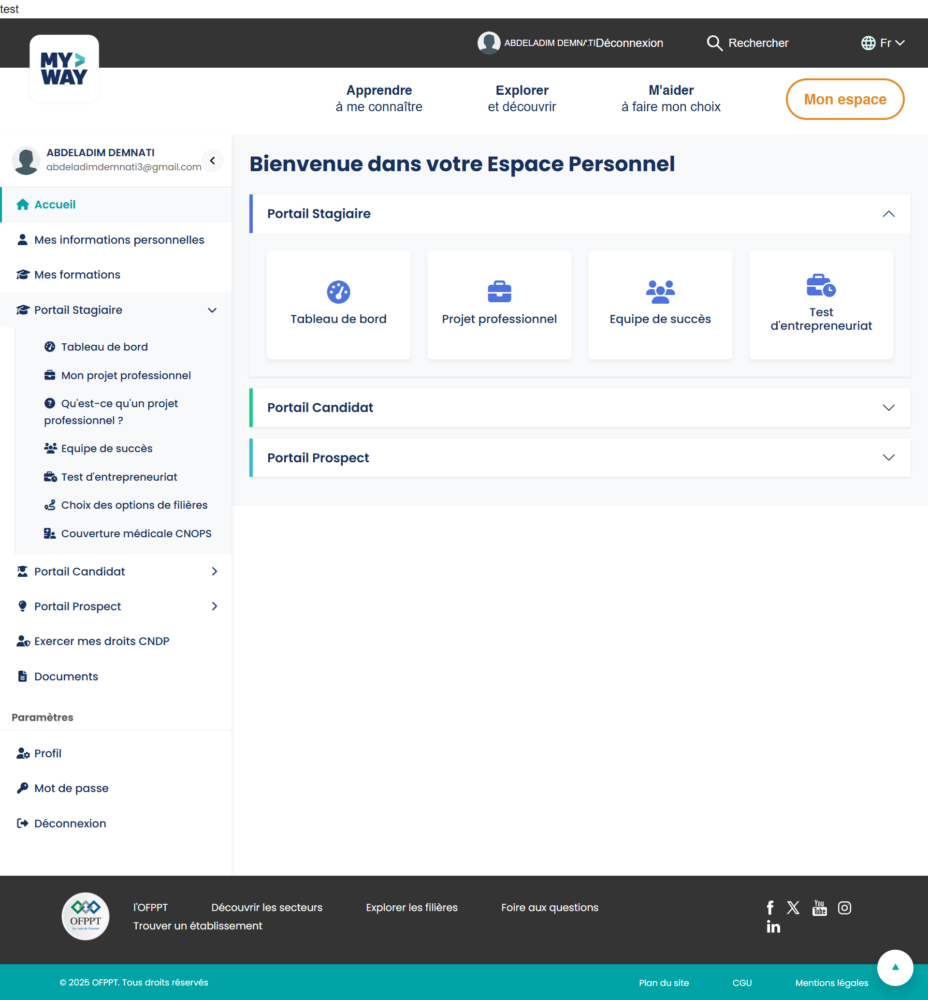

-Ce project c'est une application web destinée à gérer la présence des étudiants.   
-Stack technique : (Django pour les front-end et back-end,mySql pour la base de données,HTML,CSS ,Javascript).
-L'application permet de gérer les étudiants, les enseignants et les cours,et marker la présence des étudiants.
-L'application est composée de plusieurs modules :
1. Module d'authentification : permet aux utilisateurs de se connecter et de s'inscrire.
2. Module de gestion des étudiants : permet d'ajouter, de modifier et de supprimer des étudiants, ainsi que de consulter la liste des étudiants.
3. Module de gestion des enseignants : permet d'ajouter, de modifier et de supprimer des enseignants, ainsi que de consulter la liste des enseignants.
4. Module pour la direction : permet de consulter les statistiques de présence des étudiants et de générer des rapports.

-Type d'utilisateurs : administrateur, enseignant et étudiant et les parents aussi.
-Pour chaque type d'utilisateur, il y a des fonctionnalités spécifiques qui leur sont attribuées.
-Pour l'administrateur, il peut gérer les utilisateurs, les cours et les statistiques de présence.
-Pour le style de l'application,doit etre plus organise comme le site de l'ofppt 
voici un exemple de l'interface de l'application :
