# Plan d'Implémentation — Application de Gestion de Présence des Étudiants

---

## Table des Matières

1. [Vue d'Ensemble du Projet](#1-vue-densemble-du-projet)
2. [Architecture Technique](#2-architecture-technique)
3. [MCD — Modèle Conceptuel de Données](#3-mcd--modèle-conceptuel-de-données)
4. [MLD — Modèle Logique de Données](#4-mld--modèle-logique-de-données)
5. [Diagramme de Classes UML](#5-diagramme-de-classes-uml)
6. [Diagrammes de Cas d'Utilisation](#6-diagrammes-de-cas-dutilisation)
7. [Diagrammes de Séquence](#7-diagrammes-de-séquence)
8. [Diagramme d'État — Présence](#8-diagramme-détat--présence)
9. [Diagramme de Composants](#9-diagramme-de-composants)
10. [Structure du Projet Django](#10-structure-du-projet-django)
11. [Modèles Django (ORM)](#11-modèles-django-orm)
12. [Plan des URLs & Vues](#12-plan-des-urls--vues)
13. [Phases d'Implémentation](#13-phases-dimplémentation)
14. [Maquettes d'Interface](#14-maquettes-dinterface)

---

## 1. Vue d'Ensemble du Projet

| Élément            | Détail                                      |
|--------------------|---------------------------------------------|
| **Nom**            | GesPresence — Gestion de Présence Étudiants |
| **Stack Backend**  | Django 4.x (Python)                         |
| **Stack Frontend** | HTML5, CSS3, JavaScript, Bootstrap 5        |
| **Base de données**| MySQL 8.x                                   |
| **Style visuel**   | Inspiré du portail OFPPT (myway.ac.ma)      |

### Types d'Utilisateurs & Rôles

| Rôle              | Permissions principales                                                    |
|-------------------|----------------------------------------------------------------------------|
| **Administrateur**| Gestion complète : utilisateurs, filières, groupes, cours, rapports       |
| **Enseignant**    | Marquer la présence, consulter ses cours et sessions                       |
| **Étudiant**      | Consulter son propre historique de présence                                |
| **Parent**        | Consulter la présence de son/ses enfant(s), recevoir des notifications     |

---

## 2. Architecture Technique

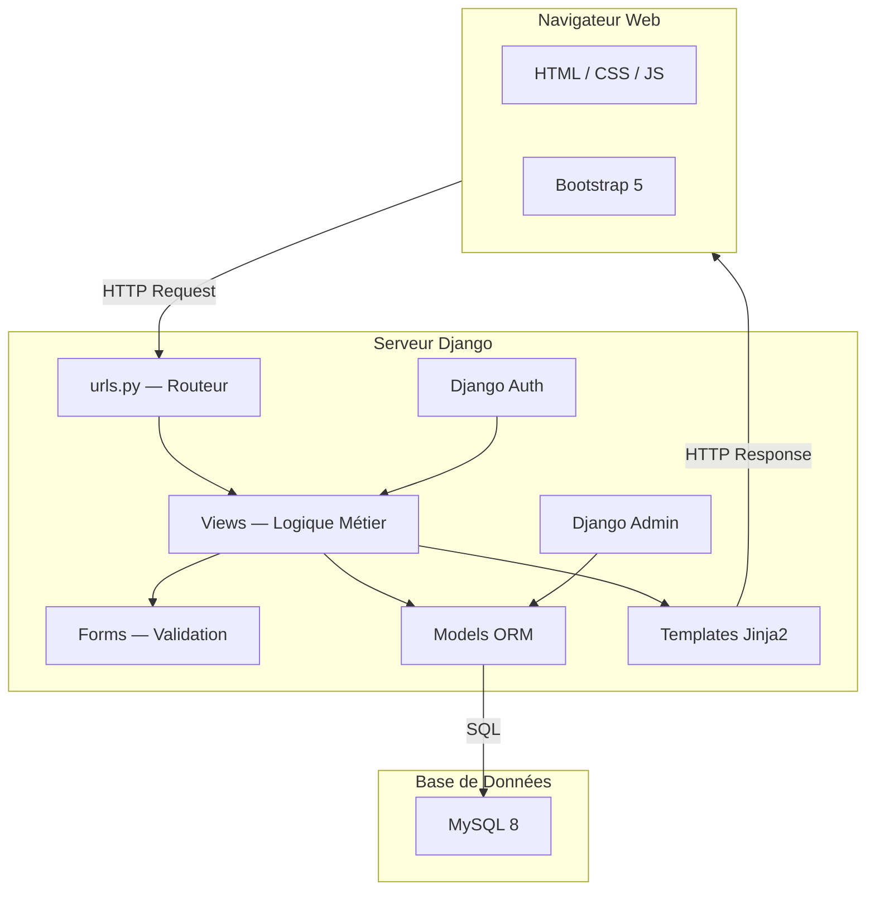

### Pattern MVT (Model–View–Template)

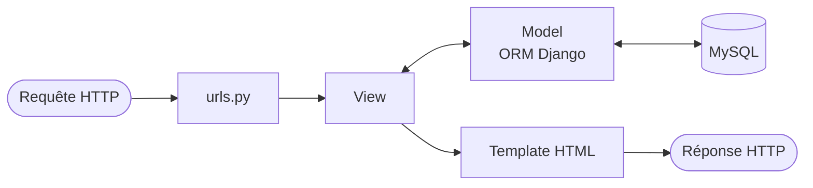

---

## 3. MCD — Modèle Conceptuel de Données

> Le MCD représente les entités métier et leurs associations sans se préoccuper de l'implémentation physique.

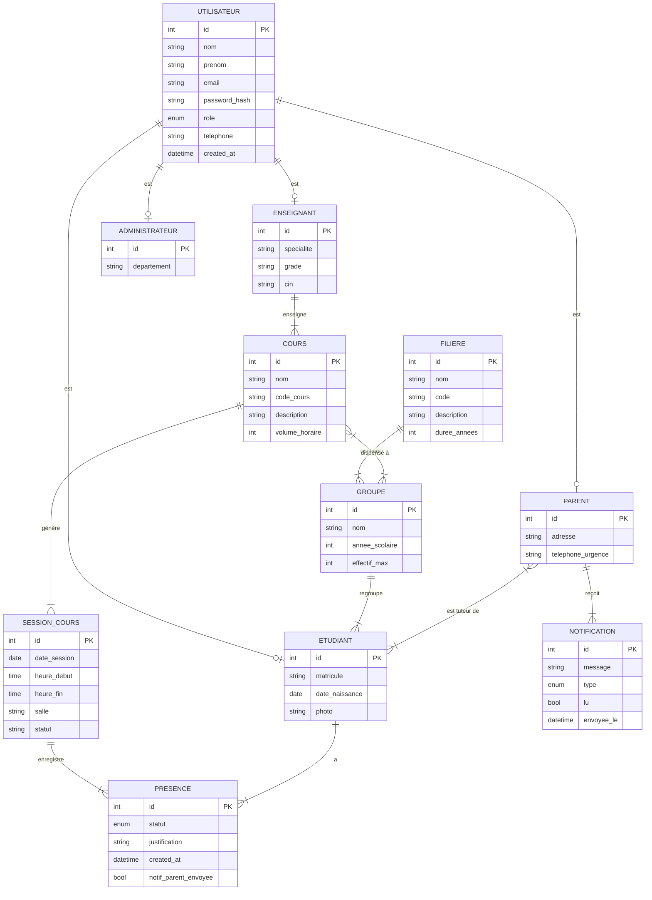

---

## 4. MLD — Modèle Logique de Données

> Le MLD traduit le MCD en tables relationnelles avec clés primaires et étrangères.

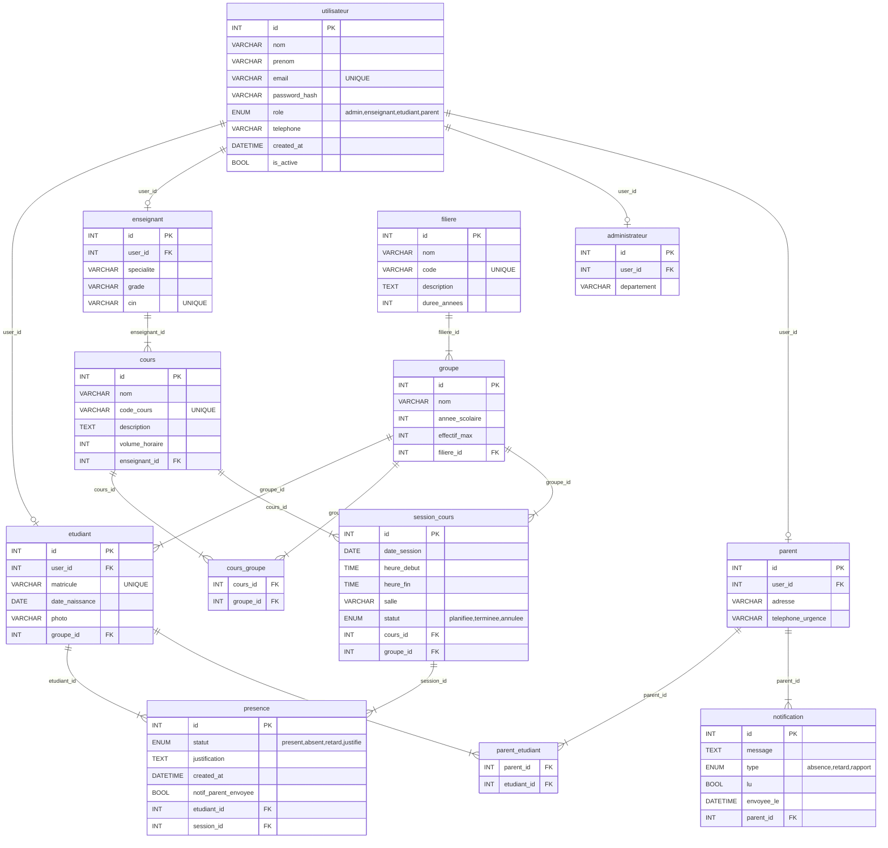

### Schéma SQL Résumé

```sql
-- Tables principales
utilisateur       (id, nom, prenom, email UNIQUE, password_hash, role, telephone, created_at, is_active)
etudiant          (id, user_id FK, matricule UNIQUE, date_naissance, photo, groupe_id FK)
enseignant        (id, user_id FK, specialite, grade, cin UNIQUE)
administrateur    (id, user_id FK, departement)
parent            (id, user_id FK, adresse, telephone_urgence)
parent_etudiant   (parent_id FK, etudiant_id FK)  -- table de jonction

filiere           (id, nom, code UNIQUE, description, duree_annees)
groupe            (id, nom, annee_scolaire, effectif_max, filiere_id FK)

cours             (id, nom, code_cours UNIQUE, description, volume_horaire, enseignant_id FK)
cours_groupe      (cours_id FK, groupe_id FK)      -- table de jonction

session_cours     (id, date_session, heure_debut, heure_fin, salle, statut, cours_id FK, groupe_id FK)
presence          (id, statut, justification, created_at, notif_parent_envoyee, etudiant_id FK, session_id FK)
notification      (id, message, type, lu, envoyee_le, parent_id FK)
```

---

## 5. Diagramme de Classes UML

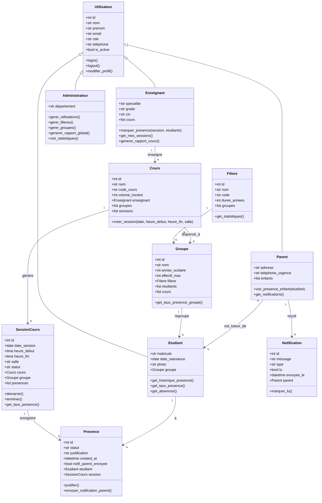

---

## 6. Diagrammes de Cas d'Utilisation

### 6.1 — Vue Globale

```mermaid
flowchart TB
    ADMIN(["👤 Administrateur"])
    ENSEIGNANT(["👤 Enseignant"])
    ETUDIANT(["👤 Étudiant"])
    PARENT(["👤 Parent"])

    subgraph SYS["Système GesPresence"]
        AUTH["Se connecter / Déconnecter"]
        PROFIL["Modifier son profil"]

        subgraph ADM_MOD["Module Administration"]
            GU["Gérer Utilisateurs"]
            GF["Gérer Filières & Groupes"]
            GC["Gérer Cours"]
            STAT["Voir Statistiques Globales"]
            RAPP["Générer Rapports"]
        end

        subgraph ENS_MOD["Module Enseignant"]
            VS["Voir Mes Sessions"]
            MP["Marquer Présence"]
            JA["Justifier une Absence"]
            RC["Rapport Cours"]
        end

        subgraph ETU_MOD["Module Étudiant"]
            HP["Consulter Mon Historique"]
            TP["Voir Mon Taux de Présence"]
        end

        subgraph PAR_MOD["Module Parent"]
            VP["Voir Présence Enfant"]
            NOTIF["Consulter Notifications"]
        end
    end

    ADMIN --> AUTH
    ADMIN --> PROFIL
    ADMIN --> GU
    ADMIN --> GF
    ADMIN --> GC
    ADMIN --> STAT
    ADMIN --> RAPP

    ENSEIGNANT --> AUTH
    ENSEIGNANT --> PROFIL
    ENSEIGNANT --> VS
    ENSEIGNANT --> MP
    ENSEIGNANT --> JA
    ENSEIGNANT --> RC

    ETUDIANT --> AUTH
    ETUDIANT --> PROFIL
    ETUDIANT --> HP
    ETUDIANT --> TP

    PARENT --> AUTH
    PARENT --> PROFIL
    PARENT --> VP
    PARENT --> NOTIF
```

### 6.2 — Cas d'utilisation : Marquer la Présence (Enseignant)

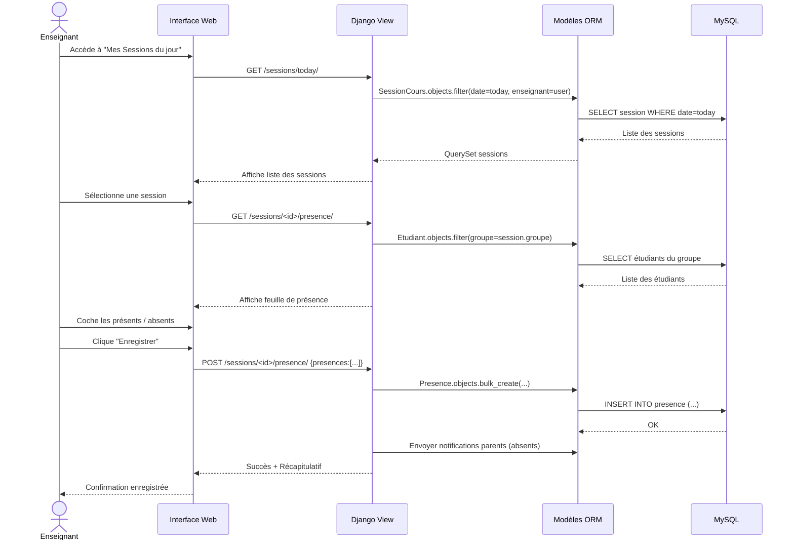

---

## 7. Diagrammes de Séquence

### 7.1 — Authentification

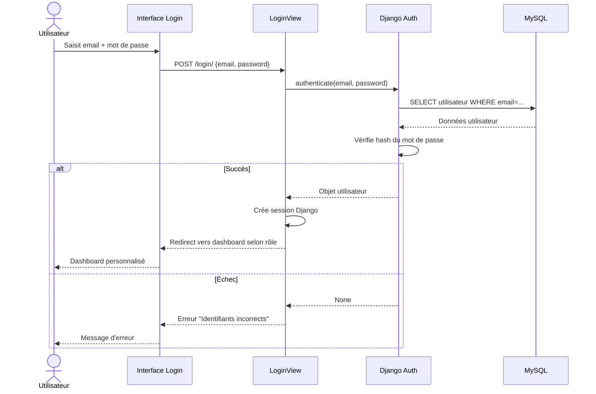

### 7.2 — Consultation Présence par le Parent

```mermaid
sequenceDiagram
    actor PAR as Parent
    participant UI as Interface Parent
    participant VIEW as ParentView
    participant MODEL as ORM
    participant NOTIF as Service Notification

    PAR->>UI: Accède au tableau de bord
    UI->>VIEW: GET /parent/dashboard/
    VIEW->>MODEL: Parent.objects.get(user=request.user)
    MODEL-->>VIEW: Objet parent + enfants liés
    VIEW->>MODEL: Presence.objects.filter(etudiant__in=enfants).recent()
    MODEL-->>VIEW: Historique des présences
    VIEW->>NOTIF: Notification.objects.filter(parent=parent, lu=False)
    NOTIF-->>VIEW: Notifications non lues
    VIEW-->>UI: Dashboard avec historique + alertes
    UI-->>PAR: Affiche données

    PAR->>UI: Clique sur une notification
    UI->>VIEW: POST /notifications/<id>/lire/
    VIEW->>MODEL: notification.lu = True; save()
    MODEL-->>VIEW: OK
    VIEW-->>UI: Notification marquée comme lue
```

### 7.3 — Génération de Rapport (Administrateur)

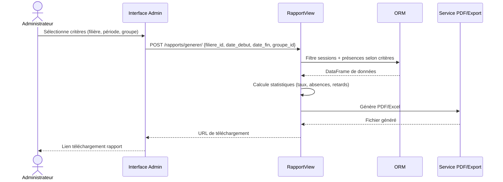

---

## 8. Diagramme d'État — Présence

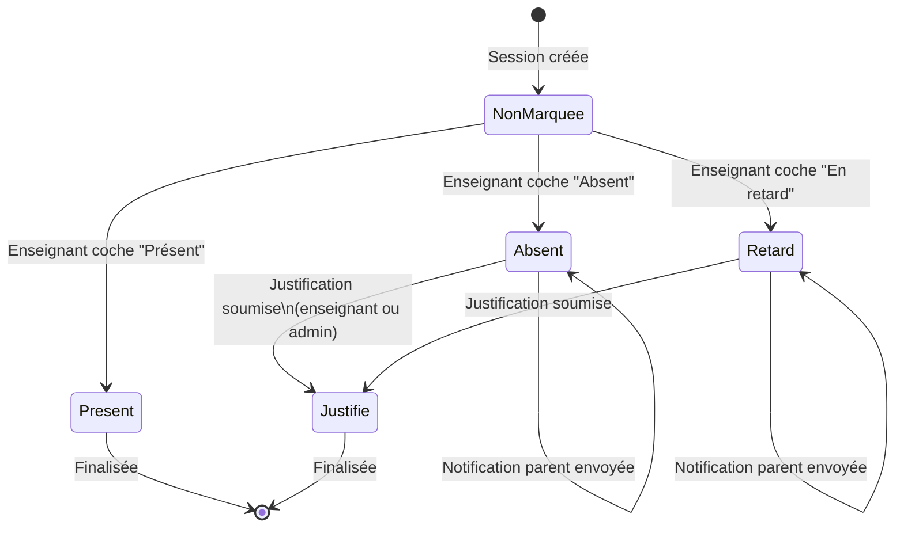

---

## 9. Diagramme de Composants

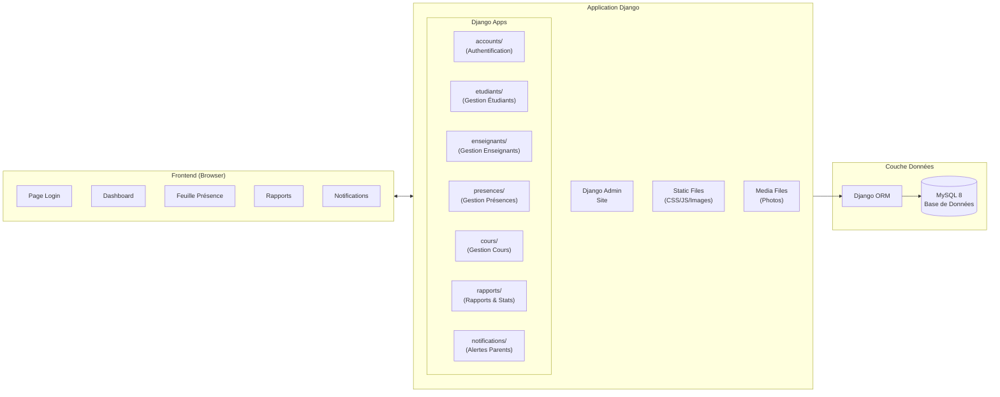

---

## 10. Structure du Projet Django

```
gespresence/
├── manage.py
├── requirements.txt
├── .env                          # Variables d'environnement (DB, SECRET_KEY)
│
├── gespresence/                  # Projet principal
│   ├── settings.py
│   ├── urls.py
│   ├── wsgi.py
│   └── asgi.py
│
├── accounts/                     # App : Authentification & Utilisateurs
│   ├── models.py                 # Utilisateur, Etudiant, Enseignant, Parent, Admin
│   ├── views.py                  # login, logout, register, profil
│   ├── forms.py
│   ├── urls.py
│   └── templates/accounts/
│       ├── login.html
│       ├── register.html
│       └── profil.html
│
├── etudiants/                    # App : Gestion des Étudiants
│   ├── models.py
│   ├── views.py
│   ├── forms.py
│   ├── urls.py
│   └── templates/etudiants/
│       ├── liste.html
│       ├── detail.html
│       └── form.html
│
├── enseignants/                  # App : Gestion des Enseignants
│   ├── models.py
│   ├── views.py
│   ├── forms.py
│   ├── urls.py
│   └── templates/enseignants/
│
├── cours/                        # App : Cours, Filières, Groupes, Sessions
│   ├── models.py                 # Cours, Filiere, Groupe, SessionCours
│   ├── views.py
│   ├── forms.py
│   ├── urls.py
│   └── templates/cours/
│
├── presences/                    # App : Marquage & Historique Présence
│   ├── models.py                 # Presence
│   ├── views.py
│   ├── forms.py
│   ├── urls.py
│   └── templates/presences/
│       ├── feuille_presence.html
│       └── historique.html
│
├── rapports/                     # App : Statistiques & Exports
│   ├── views.py
│   ├── utils.py                  # Génération PDF/Excel
│   ├── urls.py
│   └── templates/rapports/
│
├── notifications/                # App : Alertes & Notifications Parents
│   ├── models.py
│   ├── signals.py                # Envoi auto sur absence
│   ├── views.py
│   └── urls.py
│
├── static/
│   ├── css/
│   │   ├── main.css              # Style global inspiré OFPPT
│   │   └── dashboard.css
│   ├── js/
│   │   ├── presence.js           # Logique feuille présence
│   │   └── charts.js             # Graphiques statistiques
│   └── img/
│       └── logo.png
│
├── media/                        # Fichiers uploadés (photos profil)
│
└── templates/
    ├── base.html                 # Template de base avec navbar
    ├── dashboard_admin.html
    ├── dashboard_enseignant.html
    ├── dashboard_etudiant.html
    └── dashboard_parent.html
```

---

## 11. Modèles Django (ORM)

```python
# accounts/models.py
from django.contrib.auth.models import AbstractUser
from django.db import models

class Utilisateur(AbstractUser):
    ROLES = [('admin','Administrateur'),('enseignant','Enseignant'),
             ('etudiant','Étudiant'),('parent','Parent')]
    role      = models.CharField(max_length=20, choices=ROLES)
    telephone = models.CharField(max_length=20, blank=True)

class Filiere(models.Model):
    nom          = models.CharField(max_length=100)
    code         = models.CharField(max_length=20, unique=True)
    description  = models.TextField(blank=True)
    duree_annees = models.IntegerField(default=2)

class Groupe(models.Model):
    nom            = models.CharField(max_length=50)
    annee_scolaire = models.IntegerField()
    effectif_max   = models.IntegerField(default=30)
    filiere        = models.ForeignKey(Filiere, on_delete=models.CASCADE,
                                       related_name='groupes')

class Etudiant(models.Model):
    user           = models.OneToOneField(Utilisateur, on_delete=models.CASCADE)
    matricule      = models.CharField(max_length=20, unique=True)
    date_naissance = models.DateField()
    photo          = models.ImageField(upload_to='etudiants/', blank=True)
    groupe         = models.ForeignKey(Groupe, on_delete=models.SET_NULL,
                                       null=True, related_name='etudiants')

class Enseignant(models.Model):
    user       = models.OneToOneField(Utilisateur, on_delete=models.CASCADE)
    specialite = models.CharField(max_length=100)
    grade      = models.CharField(max_length=50)
    cin        = models.CharField(max_length=20, unique=True)

class Parent(models.Model):
    user               = models.OneToOneField(Utilisateur, on_delete=models.CASCADE)
    adresse            = models.TextField(blank=True)
    telephone_urgence  = models.CharField(max_length=20)
    enfants            = models.ManyToManyField(Etudiant, related_name='parents')

# cours/models.py
class Cours(models.Model):
    nom           = models.CharField(max_length=100)
    code_cours    = models.CharField(max_length=20, unique=True)
    description   = models.TextField(blank=True)
    volume_horaire = models.IntegerField()
    enseignant    = models.ForeignKey(Enseignant, on_delete=models.SET_NULL,
                                      null=True, related_name='cours')
    groupes       = models.ManyToManyField(Groupe, related_name='cours')

class SessionCours(models.Model):
    STATUTS = [('planifiee','Planifiée'),('terminee','Terminée'),('annulee','Annulée')]
    date_session = models.DateField()
    heure_debut  = models.TimeField()
    heure_fin    = models.TimeField()
    salle        = models.CharField(max_length=50)
    statut       = models.CharField(max_length=20, choices=STATUTS, default='planifiee')
    cours        = models.ForeignKey(Cours, on_delete=models.CASCADE,
                                     related_name='sessions')
    groupe       = models.ForeignKey(Groupe, on_delete=models.CASCADE)

# presences/models.py
class Presence(models.Model):
    STATUTS = [('present','Présent'),('absent','Absent'),
               ('retard','En retard'),('justifie','Justifié')]
    statut                = models.CharField(max_length=20, choices=STATUTS)
    justification         = models.TextField(blank=True)
    created_at            = models.DateTimeField(auto_now_add=True)
    notif_parent_envoyee  = models.BooleanField(default=False)
    etudiant              = models.ForeignKey(Etudiant, on_delete=models.CASCADE,
                                              related_name='presences')
    session               = models.ForeignKey(SessionCours, on_delete=models.CASCADE,
                                              related_name='presences')
    class Meta:
        unique_together = ['etudiant', 'session']
```

---

## 12. Plan des URLs & Vues

| URL                                    | Vue                        | Rôle requis       |
|----------------------------------------|----------------------------|-------------------|
| `/`                                    | `HomeView`                 | Tous              |
| `/login/`                              | `LoginView`                | Anonyme           |
| `/logout/`                             | `LogoutView`               | Authentifié       |
| `/admin/`                              | Django Admin               | Admin             |
| `/dashboard/`                          | `DashboardView`            | Tous              |
| `/etudiants/`                          | `EtudiantListView`         | Admin             |
| `/etudiants/<id>/`                     | `EtudiantDetailView`       | Admin, Enseignant |
| `/etudiants/<id>/presence/`            | `EtudiantPresenceView`     | Étudiant, Parent  |
| `/enseignants/`                        | `EnseignantListView`       | Admin             |
| `/cours/`                              | `CoursListView`            | Admin, Enseignant |
| `/cours/<id>/sessions/`                | `SessionListView`          | Enseignant        |
| `/sessions/<id>/presence/`             | `MarquerPresenceView`      | Enseignant        |
| `/presences/historique/`               | `HistoriquePresenceView`   | Tous              |
| `/rapports/`                           | `RapportListView`          | Admin             |
| `/rapports/generer/`                   | `GenererRapportView`       | Admin             |
| `/parent/dashboard/`                   | `ParentDashboardView`      | Parent            |
| `/notifications/`                      | `NotificationListView`     | Parent            |

---

## 13. Phases d'Implémentation

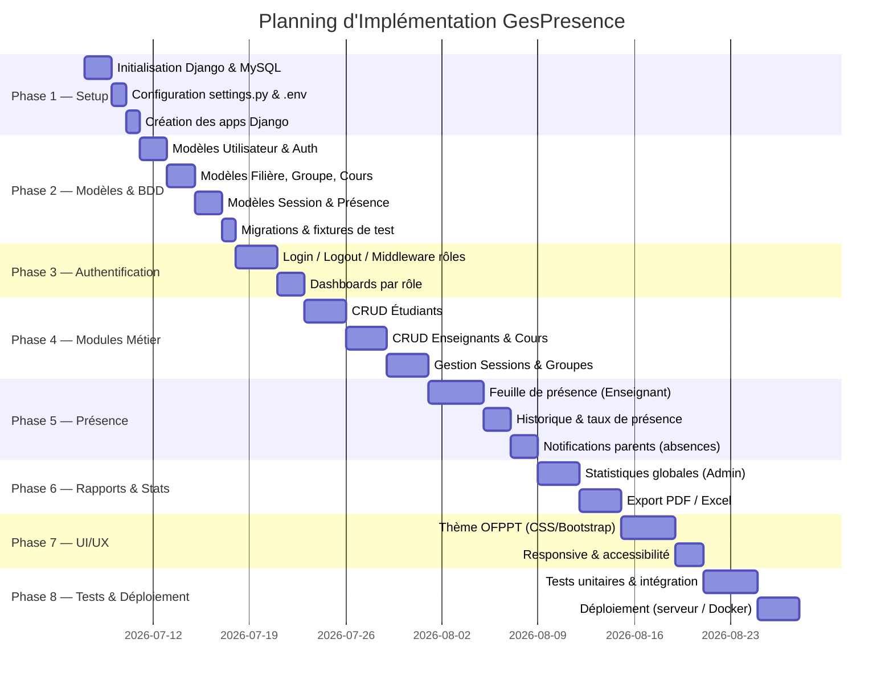

### Résumé des Phases

| Phase | Description                          | Durée estimée |
|-------|--------------------------------------|---------------|
| 1     | Setup Django + MySQL                 | ~4 jours      |
| 2     | Modèles & Base de données            | ~7 jours      |
| 3     | Authentification & Dashboards        | ~5 jours      |
| 4     | Modules CRUD (Étudiants, Cours…)     | ~9 jours      |
| 5     | Présence & Notifications             | ~8 jours      |
| 6     | Rapports & Statistiques              | ~6 jours      |
| 7     | Interface & Thème OFPPT              | ~6 jours      |
| 8     | Tests & Déploiement                  | ~7 jours      |
| **Total** |                                 | **~52 jours** |

---

## 14. Maquettes d'Interface

### Navigation principale (Sidebar — style OFPPT)

```
┌──────────────────────────────────────────────────────────┐
│  🏫  GesPresence                        [Photo Profil]   │
├──────────────────────────────────────────────────────────┤
│  SIDEBAR            │  CONTENU PRINCIPAL                 │
│  ─────────────────  │  ────────────────────────────────  │
│  📊 Tableau de bord │                                    │
│  👥 Étudiants       │   [Widget Stats]  [Widget Stats]  │
│  👨‍🏫 Enseignants    │                                    │
│  📚 Cours           │   [Tableau des dernières          │
│  ✅ Présences       │    sessions + présences]          │
│  📈 Rapports        │                                    │
│  🔔 Notifications   │   [Graphique taux présence]       │
│  ⚙️ Paramètres      │                                    │
│                     │                                    │
└──────────────────────────────────────────────────────────┘
```

### Feuille de Présence (Vue Enseignant)

```
┌─────────────────────────────────────────────────────────┐
│  Feuille de Présence — Cours: [Nom Cours]               │
│  Groupe: [Nom Groupe]  |  Date: [JJ/MM/AAAA]  |  Salle  │
├──────┬──────────────────┬───────────┬────────┬──────────┤
│  N°  │  Nom & Prénom    │  Présent  │ Absent │  Retard  │
├──────┼──────────────────┼───────────┼────────┼──────────┤
│  01  │  Ahmed BENAISSA  │    ✅     │        │          │
│  02  │  Sara ALAMI      │           │   ❌   │          │
│  03  │  Karim ZIDANE    │           │        │   ⏰     │
│ ...  │  ...             │   ...     │  ...   │  ...     │
├──────┴──────────────────┴───────────┴────────┴──────────┤
│  [Tout Présent]  [Tout Absent]       [💾 Enregistrer]   │
└─────────────────────────────────────────────────────────┘
```

---

## Dépendances Python (requirements.txt)

```txt
Django>=4.2
mysqlclient>=2.2
Pillow>=10.0          # Upload photos
django-crispy-forms   # Formulaires stylisés
crispy-bootstrap5
reportlab             # Génération PDF
openpyxl              # Export Excel
django-filter         # Filtres avancés
python-decouple       # Variables .env
whitenoise            # Static files en production
```

---

*Document généré le 2026-07-04 — Projet : Gestion de Présence des Étudiants*
